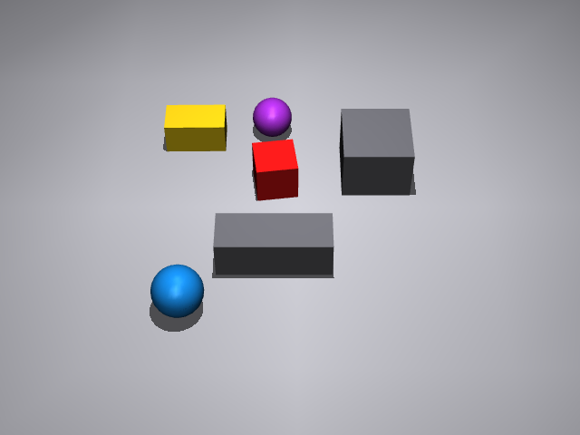

# Telekinetics

Minimal but modular scaffold for spatial reasoning experiments, using mujoco.

# telekinetic-benchmark
(This work is under development. It shifted from training environement to a benchmark philosophy, inspired by the DeepMind/Kaggle competition on cognitive benchmarks)

Trying to designed cognitive benchmarks for physical AI: spatial understanding, object-centric representations, action-conditioned.
It is set in a "telekinesis" framework: agents control objects in an abstract way. The low-level complexity of physical interaction and dynamics is partly removed, to focus on higher-level physical constraints: object collision, 3D structure, permanent identity of objects, ... . Telekinesis corresponds to the object-centric control, without embodied interaction, a good compromise for the cognitive evaluation of arbitrary embodiements in physical tasks with scene understanding, spatial reasoning and action planning. The interface and evaluation protocols remain a big challenge (visual QA, structured text output, interactive evaluation...).

This extends the vision of my PhD work on low-level reflex control for manipulation. The fast-feedback stabilization layers can handle the physical contacts, and provide abstraction over interaction. But higher-level planning and reasoning still have to be grounded in objects and causal interaction for the 3D physical world. 

TLDR: do models need contact data or interaction data ?

  <em>Task: "Move the yellow object to the left"</em>
   
  
   
   

